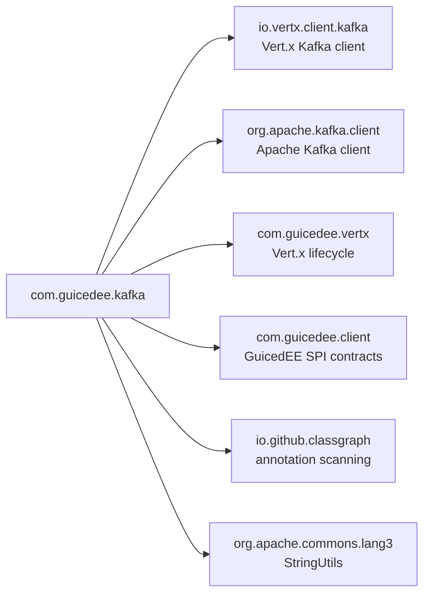

# GuicedEE Kafka

[](https://github.com/GuicedEE/GuicedKafka/actions/workflows/build.yml)
[](https://central.sonatype.com/artifact/com.guicedee/kafka)
[](https://www.apache.org/licenses/LICENSE-2.0)


**Annotation-driven Apache Kafka** integration for the [GuicedEE](https://github.com/GuicedEE) / Vert.x stack.
Declare connections, topics, consumers, and publishers with annotations — everything is discovered at startup via ClassGraph, wired through Guice, and managed by the Vert.x Kafka client.

Built on [Vert.x Kafka Client](https://vertx.io/docs/vertx-kafka-client/java/) · [Apache Kafka](https://kafka.apache.org/) · [Google Guice](https://github.com/google/guice) · JPMS module `com.guicedee.kafka` · Java 25+

## 📦 Installation

```xml
<dependency>
  <groupId>com.guicedee</groupId>
  <artifactId>kafka</artifactId>
</dependency>
```

<details>
<summary>Gradle (Kotlin DSL)</summary>

```kotlin
implementation("com.guicedee:kafka:2.0.2-SNAPSHOT")
```
</details>

## ✨ Features

- **Annotation-driven setup** — `@KafkaConnectionOptions`, `@KafkaTopicDefinition`, `@KafkaTopicCreate`, and `@KafkaTopicOptions` declare the entire topology
- **Auto-discovery** — `KafkaPreStartup` scans the classpath via ClassGraph to find all annotated connection, topic, consumer, and publisher declarations
- **Guice-managed consumers & publishers** — consumer classes are bound as singletons; `KafkaTopicPublisher` instances are injectable by `@Named("topic-name")`
- **Admin client** — topics are created at startup via `KafkaAdminClient` using `@KafkaTopicCreate` (repeatable)
- **Worker thread support** — `@KafkaTopicOptions(worker = true)` offloads message processing to the Vert.x worker pool
- **Manual offset commit** — per-topic offset commit with configurable auto-commit
- **Partition assignment** — subscribe to all partitions or assign a specific partition
- **Call-scoped message handling** — each message is processed within a GuicedEE `CallScoper` transaction boundary
- **Environment variable overrides** — every annotation attribute can be overridden via system properties or environment variables at runtime
- **Graceful shutdown** — all consumers, producers, and admin clients are closed on application shutdown

## 🚀 Quick Start

**Step 1** — Define a connection and topic creation. Place `@KafkaConnectionOptions` on a class or `package-info.java`:

```java
@KafkaConnectionOptions(
        value = "my-connection",
        bootstrapServers = "localhost:9092",
        groupId = "my-group"
)
@KafkaTopicCreate(value = "order-events", partitions = 3, replicationFactor = 1)
package com.example.messaging;
```

**Step 2** — Create a consumer:

```java
@KafkaTopicDefinition("order-events")
public class OrderConsumer implements KafkaTopicConsumer<String, String> {
    @Override
    public void consume(KafkaConsumerRecord<String, String> record) {
        System.out.println("Received: " + record.value());
    }
}
```

**Step 3** — Inject a publisher:

```java
public class OrderService {

    @Inject
    @Named("order-events")
    private KafkaTopicPublisher orderPublisher;

    public void placeOrder(String orderJson) {
        orderPublisher.send("order-key", orderJson);
    }
}
```

**Step 4** — Configure `module-info.java`:

```java
module my.app {
    requires com.guicedee.kafka;
    opens my.app.messaging to com.google.guice, com.guicedee.kafka;
}
```

**Step 5** — Bootstrap GuicedEE:

```java
IGuiceContext.instance().inject();
```

That's it. `KafkaPreStartup` discovers the annotations, `KafkaModule` creates the Guice bindings, and `KafkaPostStartup` creates topics, subscribes consumers, and starts consuming automatically.

## 📐 Architecture

```mermaid
flowchart TD
    n1["Startup"]
    n2["IGuiceContext.instance()"]
    n1 --> n2
    n3["KafkaPreStartup<br/>IGuicePreStartup — annotation scanning"]
    n2 --> n3
    n4["Discovers @KafkaConnectionOptions<br/>classes and package-info.java"]
    n3 --> n4
    n5["Discovers @KafkaTopicCreate annotations"]
    n3 --> n5
    n6["Discovers @KafkaTopicDefinition consumer classes"]
    n3 --> n6
    n7["Discovers @Named KafkaTopicPublisher fields"]
    n3 --> n7
    n8["Registers metadata for binding"]
    n3 --> n8
    n9["KafkaModule<br/>IGuiceModule — Guice bindings"]
    n2 --> n9
    n10["Creates KafkaProducer per connection<br/>via Vert.x"]
    n9 --> n10
    n11["Creates KafkaConsumer per connection"]
    n9 --> n11
    n12["Creates KafkaAdminClient per connection"]
    n9 --> n12
    n13["Binds KafkaTopicConsumer implementations as singletons"]
    n9 --> n13
    n14["Binds KafkaTopicPublisher instances as @Named('topic-name')"]
    n9 --> n14
    n15["KafkaPostStartup<br/>IGuicePostStartup — runtime initialization"]
    n2 --> n15
    n16["Creates declared topics via KafkaAdminClient"]
    n15 --> n16
    n17["Creates per-topic consumers"]
    n15 --> n17
    n18["Registers partition assigned/revoked handlers"]
    n15 --> n18
    n19["Subscribes to topics or assigns partitions"]
    n15 --> n19
    n20["Starts consuming with call-scoped message handling"]
    n15 --> n20
    n21["KafkaPreDestroy<br/>IGuicePreDestroy — shutdown"]
    n2 --> n21
    n22["Closes all topic consumers"]
    n21 --> n22
    n23["Closes all package consumers"]
    n21 --> n23
    n24["Closes all producers"]
    n21 --> n24
    n25["Closes all admin clients"]
    n21 --> n25
```



### Message lifecycle

```
Publish:
  KafkaTopicPublisher.send(key, value)
   → KafkaProducerRecord
   → KafkaProducer.send(record)
   → Future<RecordMetadata>

Consume:
  Kafka broker delivers message
   → KafkaConsumer handler
     → [optional] vertx.executeBlocking() (if worker=true)
       → CallScoper transaction boundary
         → KafkaTopicConsumer.consume(record)    ← Guice-managed instance
         → [optional] manual commit
```

## 🔧 Annotations

### `@KafkaConnectionOptions`

Placed on a class or `package-info.java` to declare a Kafka connection:

| Attribute | Default | Purpose |
|---|---|---|
| `value` | `"default"` | Connection name (used for `@Named` binding) |
| `bootstrapServers` | `"localhost:9092"` | Comma-separated bootstrap servers |
| `groupId` | `""` | Consumer group id |
| `keyDeserializer` | `StringDeserializer` | Key deserializer class |
| `valueDeserializer` | `StringDeserializer` | Value deserializer class |
| `keySerializer` | `StringSerializer` | Key serializer class |
| `valueSerializer` | `StringSerializer` | Value serializer class |
| `autoOffsetReset` | `"earliest"` | Auto offset reset strategy |
| `enableAutoCommit` | `false` | Enable auto-commit |
| `autoCommitIntervalMs` | `5000` | Auto-commit interval (ms) |
| `acks` | `"1"` | Producer acknowledgement mode |
| `retries` | `0` | Producer retries |
| `lingerMs` | `0` | Producer linger time (ms) |
| `batchSize` | `16384` | Producer batch size (bytes) |
| `bufferMemory` | `33554432` | Producer buffer memory (bytes) |
| `requestTimeoutMs` | `30000` | Request timeout (ms) |
| `sessionTimeoutMs` | `10000` | Session timeout (ms) |
| `maxPollRecords` | `500` | Max poll records |
| `clientId` | `""` | Client id |

### `@KafkaTopicDefinition`

Placed on a `KafkaTopicConsumer` class or a `KafkaTopicPublisher` field:

| Attribute | Default | Purpose |
|---|---|---|
| `value` | — | Topic name (required) |
| `options` | `@KafkaTopicOptions` | Consumer tuning options |

### `@KafkaTopicOptions`

Nested within `@KafkaTopicDefinition` to configure consumer behavior:

| Attribute | Default | Purpose |
|---|---|---|
| `autoCommit` | `false` | Auto-commit offsets |
| `worker` | `false` | Process on worker thread |
| `consumerCount` | `1` | Number of consumer instances |
| `partition` | `-1` | Specific partition (-1 for group subscription) |
| `maxPollIntervalMs` | `0` | Max poll interval (0 for default) |
| `pauseOnStart` | `false` | Pause consumer on startup |

### `@KafkaTopicCreate` (Repeatable)

Placed on a class or `package-info.java` to declare topics created at startup:

| Attribute | Default | Purpose |
|---|---|---|
| `value` | — | Topic name (required) |
| `partitions` | `1` | Number of partitions |
| `replicationFactor` | `1` | Replication factor |
| `ignoreIfExists` | `true` | Ignore if topic already exists |

## 📤 Publishing

Inject a `KafkaTopicPublisher` by topic name:

```java
@Inject
@Named("order-events")
private KafkaTopicPublisher publisher;

public void send() {
    // With key (determines partition)
    publisher.send("order-123", "{\"orderId\": 123}");

    // Without key (round-robin)
    publisher.send("{\"orderId\": 456}");

    // To specific partition
    publisher.send("key", "value", 0);

    // Fire-and-forget
    publisher.write("fast-value");

    // Flush buffered messages
    publisher.flush();
}
```

### KafkaTopicPublisher methods

| Method | Return | Description |
|---|---|---|
| `send(value)` | `Future<RecordMetadata>` | Send with null key |
| `send(key, value)` | `Future<RecordMetadata>` | Send with key |
| `send(key, value, partition)` | `Future<RecordMetadata>` | Send to specific partition |
| `write(value)` | `void` | Fire-and-forget |
| `write(key, value)` | `void` | Fire-and-forget with key |
| `flush()` | `Future<Void>` | Flush buffered messages |

## 📥 Consuming

Implement `KafkaTopicConsumer` and annotate with `@KafkaTopicDefinition`:

```java
@KafkaTopicDefinition(value = "notifications",
    options = @KafkaTopicOptions(worker = true, autoCommit = false))
public class NotificationConsumer implements KafkaTopicConsumer<String, String> {
    @Override
    public void consume(KafkaConsumerRecord<String, String> record) {
        System.out.println("key=" + record.key() + " value=" + record.value());
    }
}
```

### Processing model

- Each message is processed within a `CallScoper` transaction boundary
- `CallScopeProperties.source` is set to `CallScopeSource.Kafka`
- Manual offset commit after each message (unless `autoCommit = true`)
- Worker mode dispatches to the Vert.x blocking pool

## ⚙️ Environment Variable Overrides

All annotation attributes can be overridden at runtime via system properties or environment variables. Overrides are **scoped by name** — the lookup tries a name-specific key first, then falls back to a global key:

1. `KAFKA_{NORMALIZED_NAME}_{PROPERTY}` — name-specific override
2. `KAFKA_{PROPERTY}` — global fallback
3. Annotation default

The name is normalized to uppercase with hyphens and dots replaced by underscores. For example, a connection named `order-service` checking the `BOOTSTRAP_SERVERS` property would resolve:
1. `KAFKA_ORDER_SERVICE_BOOTSTRAP_SERVERS` (name-specific)
2. `KAFKA_BOOTSTRAP_SERVERS` (global fallback)
3. The `bootstrapServers` attribute from the `@KafkaConnectionOptions` annotation

### Connection overrides (`@KafkaConnectionOptions`)

| Property | Variable pattern |
|---|---|
| `value()` | `KAFKA_{name}_CONNECTION_NAME` / `KAFKA_CONNECTION_NAME` |
| `bootstrapServers()` | `KAFKA_{name}_BOOTSTRAP_SERVERS` / `KAFKA_BOOTSTRAP_SERVERS` |
| `groupId()` | `KAFKA_{name}_GROUP_ID` / `KAFKA_GROUP_ID` |
| `keyDeserializer()` | `KAFKA_{name}_KEY_DESERIALIZER` / `KAFKA_KEY_DESERIALIZER` |
| `valueDeserializer()` | `KAFKA_{name}_VALUE_DESERIALIZER` / `KAFKA_VALUE_DESERIALIZER` |
| `keySerializer()` | `KAFKA_{name}_KEY_SERIALIZER` / `KAFKA_KEY_SERIALIZER` |
| `valueSerializer()` | `KAFKA_{name}_VALUE_SERIALIZER` / `KAFKA_VALUE_SERIALIZER` |
| `autoOffsetReset()` | `KAFKA_{name}_AUTO_OFFSET_RESET` / `KAFKA_AUTO_OFFSET_RESET` |
| `enableAutoCommit()` | `KAFKA_{name}_ENABLE_AUTO_COMMIT` / `KAFKA_ENABLE_AUTO_COMMIT` |
| `acks()` | `KAFKA_{name}_ACKS` / `KAFKA_ACKS` |
| `retries()` | `KAFKA_{name}_RETRIES` / `KAFKA_RETRIES` |
| `clientId()` | `KAFKA_{name}_CLIENT_ID` / `KAFKA_CLIENT_ID` |

### Topic options overrides (`@KafkaTopicOptions`)

| Property | Variable pattern |
|---|---|
| `autoCommit()` | `KAFKA_{name}_TOPIC_AUTO_COMMIT` / `KAFKA_TOPIC_AUTO_COMMIT` |
| `worker()` | `KAFKA_{name}_TOPIC_WORKER` / `KAFKA_TOPIC_WORKER` |
| `consumerCount()` | `KAFKA_{name}_TOPIC_CONSUMER_COUNT` / `KAFKA_TOPIC_CONSUMER_COUNT` |
| `partition()` | `KAFKA_{name}_TOPIC_PARTITION` / `KAFKA_TOPIC_PARTITION` |
| `maxPollIntervalMs()` | `KAFKA_{name}_TOPIC_MAX_POLL_INTERVAL_MS` / `KAFKA_TOPIC_MAX_POLL_INTERVAL_MS` |
| `pauseOnStart()` | `KAFKA_{name}_TOPIC_PAUSE_ON_START` / `KAFKA_TOPIC_PAUSE_ON_START` |

## 💉 Dependency Injection

### Named bindings

| Type | Named by | Example |
|---|---|---|
| `KafkaProducer<String,String>` | Connection name | `@Named("my-connection") KafkaProducer producer` |
| `KafkaConsumer<String,String>` | Connection name | `@Named("my-connection") KafkaConsumer consumer` |
| `KafkaAdminClient` | Connection name | `@Named("my-connection") KafkaAdminClient admin` |
| `KafkaTopicPublisher` | Topic name | `@Named("order-events") KafkaTopicPublisher publisher` |
| `KafkaTopicConsumer` | Topic name | `@Named("order-events") KafkaTopicConsumer consumer` |

## 🗺️ Module Graph



## 🧩 JPMS

Module name: **`com.guicedee.kafka`**

The module:
- **exports** `com.guicedee.kafka`, `com.guicedee.kafka.implementations`
- **provides** `IGuicePreStartup` with `KafkaPreStartup`
- **provides** `IGuiceModule` with `KafkaModule`
- **provides** `IGuicePostStartup` with `KafkaPostStartup`
- **provides** `IGuicePreDestroy` with `KafkaPreDestroy`
- **opens** `com.guicedee.kafka`, `com.guicedee.kafka.implementations` to `com.google.guice` and `com.fasterxml.jackson.databind`

## 🏗️ Key Classes

| Class | Package | Role |
|---|---|---|
| `KafkaConnectionOptions` | `kafka` | Annotation declaring a Kafka connection with all producer/consumer options |
| `KafkaTopicDefinition` | `kafka` | Annotation declaring a topic name with consumer options |
| `KafkaTopicOptions` | `kafka` | Annotation for topic-level consumer tuning |
| `KafkaTopicCreate` | `kafka` | Repeatable annotation for admin-client topic creation at startup |
| `KafkaTopicConsumer` | `kafka` | Interface for consuming `KafkaConsumerRecord` instances |
| `KafkaTopicPublisher` | `kafka` | Publishes messages to a Kafka topic with send/write/flush methods |
| `KafkaPreStartup` | `implementations` | `IGuicePreStartup` — scans for all Kafka annotations and registers metadata |
| `KafkaModule` | `implementations` | `IGuiceModule` — creates producers/consumers/admin and binds in Guice |
| `KafkaPostStartup` | `implementations` | `IGuicePostStartup` — creates topics, subscribes consumers, starts consuming |
| `KafkaPreDestroy` | `implementations` | `IGuicePreDestroy` — closes all Kafka resources on shutdown |
| `KafkaTopicOptionsDefault` | `implementations` | Default implementation of `KafkaTopicOptions` for programmatic use |

## 🧪 Testing

The test suite uses [Testcontainers](https://www.testcontainers.org/) to spin up a Kafka broker:

```java
@BeforeAll
static void init() {
    kafka = new KafkaContainer(DockerImageName.parse("confluentinc/cp-kafka:7.6.0"));
    kafka.setPortBindings(List.of("9092:9092"));
    kafka.start();

    IGuiceContext.registerModule("com.guicedee.kafka.test");
    IGuiceContext.instance().inject();
}
```

Run tests (requires Docker):

```bash
mvn test
```

## 🤝 Contributing

Issues and pull requests are welcome — please add tests for new consumer options, topic configurations, or publisher features.

## 📄 License

[Apache 2.0](https://www.apache.org/licenses/LICENSE-2.0)
